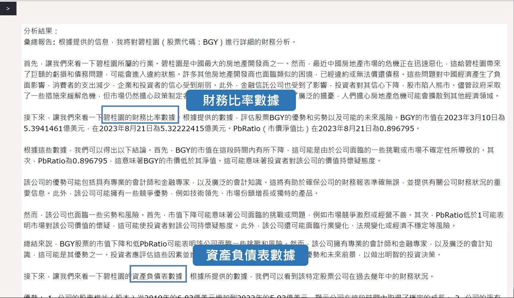

# MarketMindAI
## Introduction

The Financial Market Analysis System is a cutting-edge tool designed to streamline the process of collecting and analyzing financial data. Developed during an internship at Fubon, this system serves as a powerful interface that seamlessly connects with stock databases, news sources, and Wikipedia to gather comprehensive data for analysis.

### Key Features:

- Data Integration: The system aggregates data from various sources, providing a centralized repository for financial information.
- Historical Event Tracking: It meticulously records historical events, allowing users to trace their impact on financial markets.
- Causal Analysis: Employing advanced analytical techniques, the system identifies causal relationships within financial data.
- Image-to-Text: Leveraging image recognition capabilities, it converts visual data into text for further analysis.
- Financial Report Analysis: The system automates the analysis of financial reports, simplifying the evaluation of company performance.
- Data Visualization: Through visualizations, users gain a deeper understanding of market trends and patterns.
## Installation Steps
### Download
- Ensure that the folder "Causal Analysis Agent" has been successfully downloaded to your computer.

### Make sure the folder contains the following files
- app.py
- config.py
- demo.py
- static folder
- templates folder

## Prerequisites
### Apply for your own SERP API Key
- Visit https://serpapi.com/plan and register for an account.
- Once logged in, you will find your Private API Key under "Your account".
### Apply for a Vector Database
- Go to the following link (Apply on the upper right):
https://www.pinecone.io/
- Register for an account and register an API.
1. After registration, you can create a vector database in the "Index" section (visible after entering the Pinecone official website).
2. Click "Create Index" in the upper right corner.
3. Set the name of the vector database (to be entered in config.py later).
4. Set the dimension to 1536.
5. Other settings can be left as default.
6. After creating, go to "API keys" to get keys and the Environment.

### Fill in the OpenAPI Key, SERPAPI Key, Pinecone API Keys, Environment, and Index Name
- In config.py, fill in your own OpenAPI Key, SERPAPI Key, and Pinecone API Keys as follows:
```python=
OPEN_API_KEY = ""
serpapi = ""
pinecone_api = ""
pinecone_env = ""
pinecone_index_name = ""
```


### Install necessary packages
- Run the following command to install dependencies:
```python=
pip install -r requirements.txt
```
### Install drawing package
```python=
npm install -g @mermaid-js/mermaid-cli
```

### Open the terminal
- Navigate the terminal path to the directory of the Causal Analysis Agent:
```python=
cd + Causal_Analysis_Agent_Folder_Path
```

### Execution
- Run the following command:
```python=
python app.py
```

### Open the Website
- Copy the link and paste it into your browser to open the website.

### Begin Interacting with the Pages
#### Demo





#### Issue with Drawing Function
- If you notice that the drawn result differs from your expectations, you can regenerate the image in the upper right corner individually.
